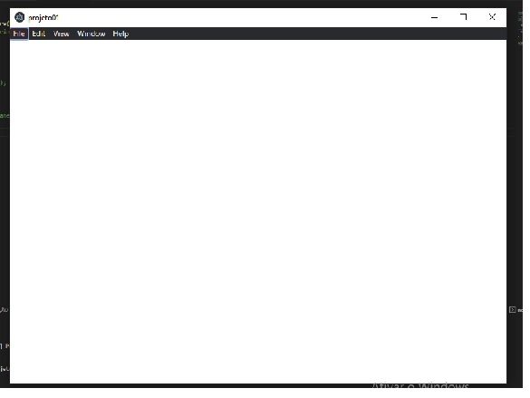
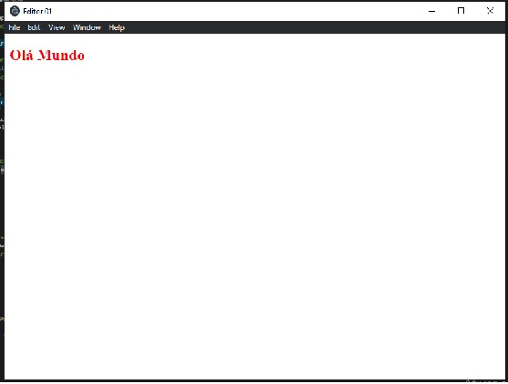
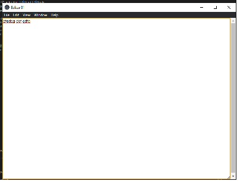
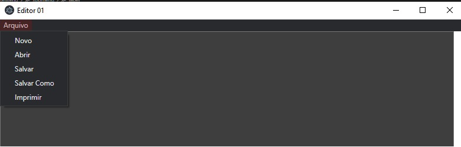
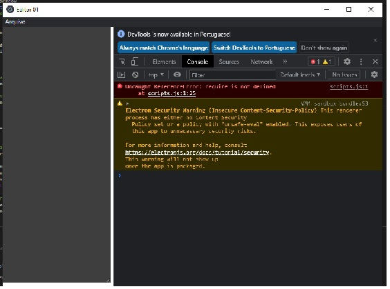
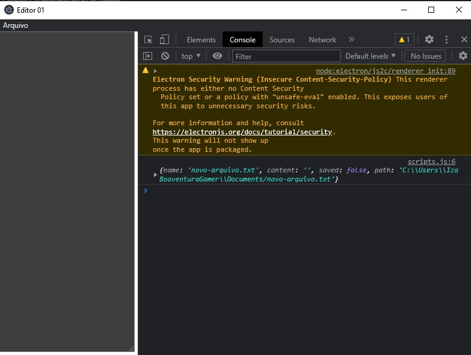
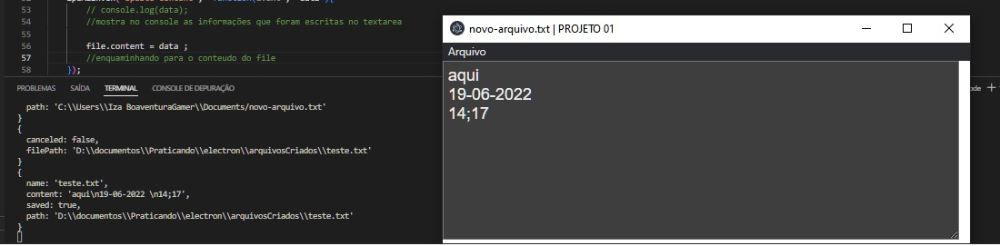

# Editor de Texto

Primeiro projeto com Electron, Editor de texto, baseado na video aula de William Costa - `WDEV`. 

	https://www.youtube.com/watch?v=rBeEvzwI11c

Titulo:	
	
	Electron JS: Desenvolvendo uma aplicação desktop com HTML, CSS e JavaScript

Electron Framework multiplataforma 

Documentação do electron

	https://www.electronjs.org/pt/docs/latest/

## Trabalhando 

Criando o projeto.

* Iniciando os comandos do node:
	- `npm init -y`
		- cria o arquivo `package.json`, neste arquivo  há as instruções principais do projeto;
* Modificando o arquivo package.json
	- eliminado o script `test`
	- criando o `start`
	- renomeando o  `main`
* Instalar o electron
	- `npm install electron`
* Criando o projeto principal
	- `main.js ` que estará dentro do pasta raiz
* Criar a dependencia dentro do arquivo main
	- const { app } = require('electron'); 
* Rodar para testar se o projeto esta funcionando sem erros 
	- `npm start`
* Configurar a aplicação ( trabalhando dentro do main)
	- criando a janela principal `createWindow`, executando para verificar `npm start`;
* Configurando a janela principal usando `async`para que o projeto só execute uma parte depois que receber a resposta da outra parte;
* Importar dependencia para a janela `browserWindow`;
* Com as configurações básicas da janela criada, testar `npm start`;
	- Primeira tela: 
	
	

	- Criada a janela básica do próprio electron
* Criando uma pagina para receber o HTML 
* Criar na raiz do projeto a pasta `src` dentro dela a pasta `pages`, e dentro da pasta pages , criar a pasta `editor` que será a pasta dos arquivos deste editor que estamos criando agora. Dentro da pasta editor criar o arquivo `index.html`.
* Criar a estrutura do HTML e `Ola Mundo`para o primeiro teste;
* Dentro do main fazer ele buscar o arquivo HTML criado em separado;
	- Teste da inclusão HTML bem sucedido.

	

* Adicionar o textarea para a página HTML;
* Criar e adicionar o arquivo de estilo deste HTML;
* Teste com o arquivo abrindo  e criando um Text area

	

* Configurações de estilo da TextAarea ( lembre -se de fechar a aplicação para fazer as mudanças );
* Voltando para o main.js. 
* A janela já foi criada, agora temos de criar os Menus desta janela 

### Criando Menu - Novo

* Menu da janela sendo aberta `Menu`;
* Criando o menu `Arquivo`com seus atributos;

	

* Definindo as ações de cada atributo do Menu, na aplicação dele o 'Fechar' ficou mostrando um atalho, em minha versão não apareceu o atalho.
* Receber a mensagem de que é um novo arquivo no index.html;
* Criar o arquivo `script.js`, no mesmo caminho do arquivo index.html e estilo.css ;
* O arquivo `script.js`será o responsável pela renderização do projeto;
* O que acontece dentro do main conseguimos ver no terminal,  mas o que acontece dentro do renderizador,  só conseguimos ver dentro dos `DEV-TOOLS` , ferramentas de desenvolvimento dos navegadores;
* Para ativar os dev-tools iremos fazer no main depois do carregamento da pagina HTML;
* Carregou o Dev Tools:

	

* Indica um erro no projeto, como se require não estivesse sendo definida dentro do script, entretanto há esta definição no arquivo script.js. Por segurança o electron não traz as integrações com o node liberadas , sendo necessário fazer esta liberação, esta liberação é realizada dentro do main.js  junto com as propriedades de tamanho da tela. Ficando desta forma:

		mainWindow = new BrowserWindow({      
			width: 800, 
			height: 600,
			webPreferences:{
				nodeIntegration: true
			}      
		});
	
* Reabrindo o projeto;
	- No exemplo a situação desapareceu;
	- No meu projeto a situação persiste;
		- solução da Alura: https://cursos.alura.com.br/forum/topico-problemas-para-criar-uma-janela-161504

				webPreferences: {
					nodeIntegration: true,
					contextIsolation: false
				}
	
	

* Modificando o novo arquivo, colocando no arquivo index.html o id para o title para ser usado no script.js;
* Quando abre  um novo arquivo ele começa com o titulo renomeado e com o textarea em branco; 
* Passado estas caracteristicas ( tudo em branco e titulo renomeado ) para o inicio do arquivo.
* Finalizada a parte de criar um novo arquivo.

### Salvar Como

Agora será salvo os arquivos dentro do disco, vamos usar os menus 'Salvar'  e 'Salvar Como' e depois o menu de 'Abrir';

* Começaremos com o `salvar como`;
* Dentro da Função de salvar como, será aberta a caixa de dialogo para o usuario definir onde ele deseja salvar o arquivo que esta criando. Para isto iremos precisar de outra dependência do electron `dialog`para abrir a caixa de dialogo com o usuário;
* Esta abrindo a caixa de dialog e permitindo que navegamos nas pastas e criar novas pastas;
* Resposta do console log

		{
			name: 'novo-arquivo.txt',
			content: '',
			saved: false,
			path: 'C:\\Users\\Iza BoaventuraGamer\\Documents/novo-arquivo.txt'
		}
		{
			canceled: false,
			filePath: 'C:\\Users\\Iza BoaventuraGamer\\Documents\\novo-arquivo.txt'
		}

* Foi feito mais partes do codigo
* Pegando as informações do TextArea e encaminhando para o `file.content`- ok

	

* Arquivo salvo e com o conteudo; 

### Salvar

* Salvar realizado;

### Abrir

* Abrir arquivos já salvos ou outros;
* Abrindo os arquivos, podendo editar , salvar e salvar como;
* FEITO

### Atalhos

Colocaremos os atalhos em todos os sub-menus; 
* Adicionando separador dentro das submenus;

* botão de ajuda;

